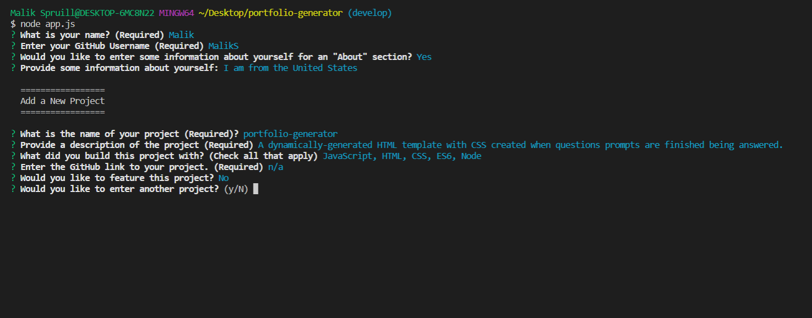

# portfolio-generator &middot;   

## Description
Portfolio Generator consists of a dynamically-created HTML and CSS styled portfolio using Node.js from the command-line.  There would be a couple of prompted questions the user will have to answer after executing `node app.js` from the command line.  After all the questions are answered, the user will have a fully-functional HTML template they will be able to continue customizing or would be able to use as-is.  The template will allow you to specify an the title of the project, description, choose whether to have it featured, and will also be able to list multiple projects.

 I built this project to enhance skills using Node.js while providing a useful tool for developers/users

## Installation
Since Node.js is used for this project, you would have to clone the repo or make sure it's downloaded to your computer. 
 
 
Open the repo using an IDE like Visual Studio Code (VS Code).  
From there, open a cli tool (like git bash for windows or terminal for mac) and make sure you `cd` to the root directory of the folder holding the repo.  
Type `npm init` or `npm init -y` to skip answering the questions prompts for including package.json in your repo.  
From there, type `npm install inquirer`, as both the **inquirer** and **fs** packages are required to properly run this repo.  
After everything is properly installed, type `node app.js` in the command line and the prompts should be begin working from there, providing a complete HTML portfolio template when all quesitons are answered.  The template should appear in the **dist** subdirectory folder on completion, including the css stylesheet.

## Technologies Used
- JavaScript
- CSS 
- Node
- NPM (Inquirer and fs packages)

## Contributions 
Malik Spruill

